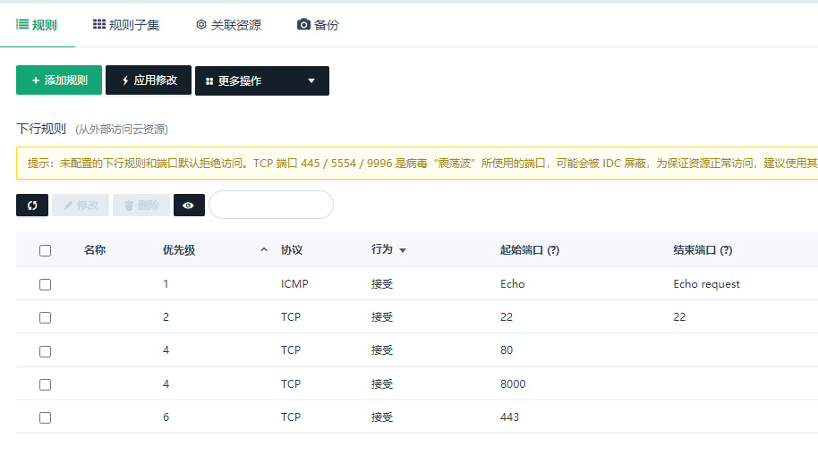

# Server Configuration

  + [Folder](#folder)

  + [Software](#software)

  + [Library](#library)

## Folder

***

```
/workspace
  /bash
  /c
  /cc
  /javascript
  /python
/site
  /frontend
  /backend
    /api
    /backend
    /media
    /static
      /css
      /image
      /js
    /templates
      /web_page_name
/download
```

## Software

***

  + set security group

    - 

  + debian apt update

    - mirrors

      - copy src/sources.list to /etc/apt/sources.list

    - apt update 

    - apt upgrade

  + gcc/g++: apt install build-essential

  + version management command:

      - update-alternatives --install /usr/bin/gcc gcc /usr/bin/gcc-4.8 20

      - update-alternatives --install /usr/bin/g++ g++ /usr/bin/g++-4.8 20

  + vim

    - apt install vim

    - copy src/.vimrc to ~/.vimrc

  + tree: apt install tree

  + make: apt install make (included in build-essential)

  + python3

    - python3.7.3: debian10 has python3.7.3 installed

    - apt install python3-dev

    - setuptools

    - pip(copy pip.conf to ~/.pip/pip.conf)

  + apache

  + nginx

  + mod_wsgi: apt install libapache2-mod-wsgi-py3

  + mysql

  + git: apt install git

  + nodejs and npm(copy src/.npmrc to ~/.npmrc)

## Library

***

  + python

    - django

  + javascript

    - react
