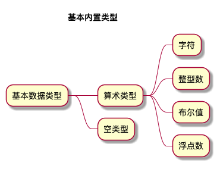

# 变量和基本类型

  + [基本内置类型](#基本内置类型)

## 基本内置类型

***

  + C++定义了一套包括算术类型和空类型在内的基本数据类型。

    - 

| 类型 | 含义 | 最小尺寸 | 介绍 |
| :----: | :----: | :----: | :----: |
| bool | 布尔类型 | 未定义 | 取值为true或false |
| char | 字符 | 8位 | char空间应确保存放机器基本字符集中任意字符对应的数字值|
| wchar_t | 宽字符| 16位 | wchar_t类型用于确保可以存放机器最大扩展字符集中的任意一个字符 |
| char16_t | Unicode字符 | 16位 | 为Unicode字符集服务 |
| char32_t | Unicode字符 | 32位 | 为Unicode字符集服务 |
| short | 短整型 | 16位 | |
| int | 整型 | 16位 | 一个int至少和一个short一样大 |
| long | 长整型 | 32位 | 一个long至少和一个int一样大 |
| long long | 长整型 | 64位 | 一个long long至少和一个long一样大 |
