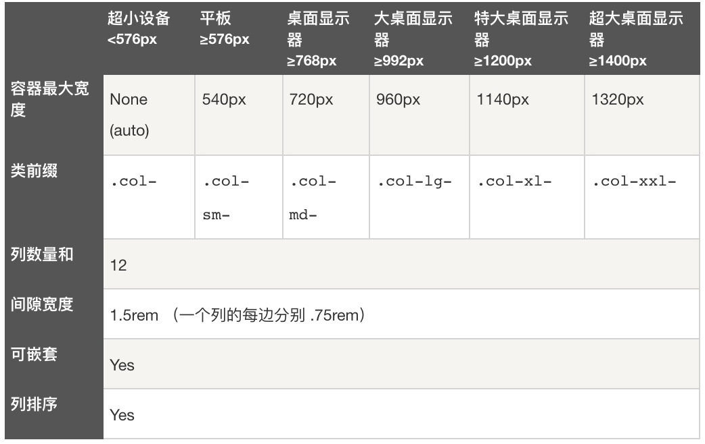

# 从Runoob上学习Bootstrap

## Bootstrap简介

  + Bootstrap是全球最受欢迎的前端组件库，用于开发响应式布局、移动设备优先的WEB项目。

  + 使用CDN库的基本HTML源文件

    - src: bootstrap_base.html

## Bootstrap基础

  + 容器

    - .container：用于固定宽度并支持响应式布局的容器。

      - 

    - .container-fluid：用于100%宽度，占据全部视口（viewport）的容器。

    - .container-sm|md|lg|xl|xxl：响应式容器

      - 

    - 容器都有填充左右内边距，顶部和底部没有填充内边距。

  + 网格系统

    - Bootstrap提供了一套响应式、移动设备优先的流式网格系统，随着屏幕或视口（viewport）尺寸的增加，系统会自动分为最多12列。

    - Bootstrap的网格系统是响应式的，列会根据屏幕大小自动重新排列。请确保每一行中列的总和等于或小于12。

    - 

    - 网格每一行需要放置在容器中，这样可以自动设置一些外边距与内边距。

    - .row设置行

    - .col-*-*设置列

    - .offset-*-*设置偏移

```html
<!-- 让 Bootstrap 自动处理布局 -->
<div class="container-fluid mt-3">
  <div class="row">
    <div class="col p-3 bg-primary text-white">.col</div>
    <div class="col p-3 bg-dark text-white">.col</div>
    <div class="col p-3 bg-primary text-white">.col</div>
  </div>
</div>
<!-- 控制列的宽度及在不同的设备上如何显示 -->
<div class="container-fluid mt-3">
  <div class="row">
    <div class="col-*-* p-3 bg-primary text-white">.col</div>
    <div class="col-*-* p-3 bg-dark text-white">.col</div>
    <div class="col-*-* p-3 bg-primary text-white">.col</div>
  </div>
</div>
<!-- 多端响应式布局 -->
<div class="container-fluid mt-3">
  <div class="row">
    <div class="col-sm-3 col-md-6 col-lg-4 col-xl-2 p-3 bg-primary text-white">.col</div>
    <div class="col-sm-9 col-md-6 col-lg-8 col-xl-10 p-3 bg-dark text-white">.col</div>
  </div>
</div>
```

  + 文字排版

    - Bootstrap5默认设置：font-size为16px，line-height为1.5。默认的font-family为<kbd>"Helvetica Neue", Helvetica, Arial, sans-serif</kbd>。所有的p元素margin-top为0，margin-bottom为1rem（16px）。

    - src: bootstrap_text_layout.html

  + 颜色

    - src: bootstrap_color.html

  + 表格

    - src: bootstrap_table.html

## Bootstrap其余类

  + margin

| Class | Description |
| ----- | ----------- |
| .m-n | n=(0~5, auto), margin all |
| .mx-n | n=(0~5, auto), margin left, right |
| .my-n | n=(0~5, auto), margin top, bottom |
| .mt-n | n=(0~5, auto), margin top |
| .me-n | n=(0~5, auto), margin right |
| .mb-n | n=(0~5, auto), margin bottom |
| .ms-n | n=(0~5, auto), margin left |

  + padding

| Class | Description |
| ----- | ----------- |
| .p-n | n=(0~5), padding all |
| .px-n | n=(0~5), padding left, right |
| .py-n | n=(0~5), padding top, bottom |
| .pt-n | n=(0~5), padding top |
| .pe-n | n=(0~5), padding right |
| .pb-n | n=(0~5), padding bottom |
| .ps-n | n=(0~5), padding left |
