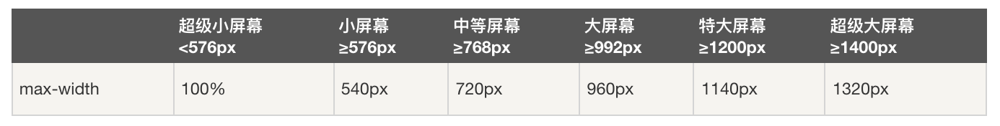
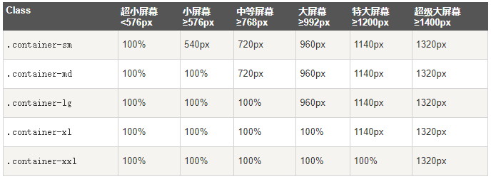

# 从Runoob上学习Bootstrap

## Bootstrap简介

  + Bootstrap是全球最受欢迎的前端组件库，用于开发响应式布局、移动设备优先的WEB项目。

  + 使用CDN库的基本HTML源文件

    - src: bootstrap_base.html

## Bootstrap基础

  + 容器

    - .container：用于固定宽度并支持响应式布局的容器。

      - 

    - .container-fluid：用于100%宽度，占据全部视口（viewport）的容器。

    - .container-sm|md|lg|xl|xxl：响应式容器

      - 

    - 容器都有填充左右内边距，顶部和底部没有填充内边距。

## Bootstrap其余类

  + background-color

    - bg-primary, bg-secondary, .bg-light, bg-dark, bg-black, bg-white

  + text-color

    - text-primary, text-secondary, .text-light, text-dark, text-black, text-white

  + margin

| Class | Description |
| ----- | ----------- |
| .m-n | n=(0~5, auto), margin all |
| .mx-n | n=(0~5, auto), margin left, right |
| .my-n | n=(0~5, auto), margin top, bottom |
| .mt-n | n=(0~5, auto), margin top |
| .me-n | n=(0~5, auto), margin right |
| .mb-n | n=(0~5, auto), margin bottom |
| .ms-n | n=(0~5, auto), margin left |

  + padding

| Class | Description |
| ----- | ----------- |
| .p-n | n=(0~5), padding all |
| .px-n | n=(0~5), padding left, right |
| .py-n | n=(0~5), padding top, bottom |
| .pt-n | n=(0~5), padding top |
| .pe-n | n=(0~5), padding right |
| .pb-n | n=(0~5), padding bottom |
| .ps-n | n=(0~5), padding left |
