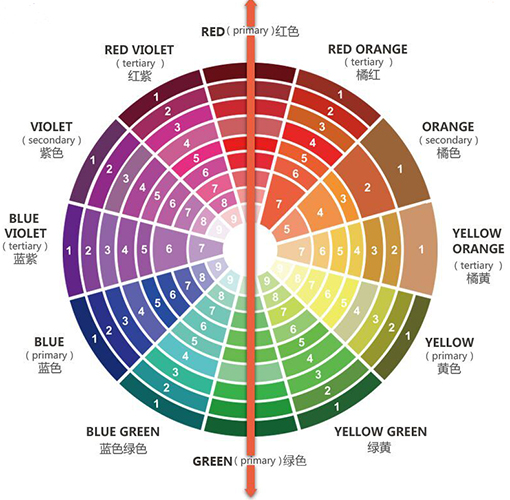

# 从Runoob上学习JavaScript

## JavaScript简介

  + JavaScript是脚本语言

    - JavaScript是一种轻量级的编程语言。

    - JavaScript是可插入HTML页面的编程代码。

    - JavaScript插入HTML页面后，可由所有的现代浏览器执行。

  + JavaScript用法

    - 脚本可位于body和head部分中，或者同时存在于两个部分中。脚本会在页面加载时执行。

```html
<script>
function hello() {
  document.getElementById('demo').innerHTML='Hello World';
}
<script>

<script src='my_script.js'></script>
```

## JavaScript语法和函数

  + 输出

```javascript
console.log('new content');
window.alert('new content');
document.write('new content');
document.getElementById('demo').innerHTML = 'new content';
```

  + 变量

    - 声明却不赋初值的变量，其值为undefined。

    - 在ES6之前，JavaScript只有两种作用域：全局变量和函数内的局部变量。var关键字声明的变量不具备块级作用域，let关键字声明的变量具备块级作用域。

    - const定义的变量并非常量，并非不可变，它定义了一个常量引用一个值。使用const定义的对象或者数组，可以修改对象内的值，但是不能重新赋值新对象。

  + 数据类型

    - 基本类型：字符串，数字，布尔，空，未定义。

    - 引用数据类型：对象，数组，函数。

  + 数组

```javascript
var cars = Array();
car[0] = 'BMW';

var num = (1, 2, 3);
```

  + 对象

```javascript
var person = {
  firstName : 'John';
  lastName : 'Doe';
  id : 5555;
  fullName : function () {
    return this.firstName + ' ' + this.lastName;
  }
};
// function() { return this.firstName + ' ' + this.lastName; }
console.log(person.fullName);
// John Doe
console.log(person.fullName());
```

 + 函数

```javascript
function myFunc(a, b) {
  return a * b;
}
console.log(myFunc(1, 2));
```

  + 事件

    - 事件可以用于处理表单验证，用户输入，用户行为及浏览器动作：页面加载时触发事件；页面关闭时触发事件；用户点击按钮执行动作；验证用户输入内容的合法性等等。

    - 可以是哦那个多种方法来执行JavaScript事件代码：HTML事件属性可以直接执行JavaScript代码；HTML事件属性可以调用JavaScript函数；为HTML元素指定自己的事件处理程序等等。

    - [HTML DOM 事件](https://runoob.com/jsref/dom-obj-event.html)

```html
<!-- onchange -->
<body>
  <input type="text" id="fname" onchange="myFunction()" />
  <p>当你离开输入框后，函数将被触发，将小写字母转为大写字母。</p>
<script>
  function myFunction() {
    var x = document.getElementById('fname');
    x.value = x.value.toUpperCase();
  }
</script>
</body>

<!-- onclick -->
<body>
  <button onclick="myFunction()">Click Me</button>
  <p id="demo"></p>
<script>
  function myFunction() {
    document.getElementById('demo').innerHTML = 'hello, world';
  }
</script>
</body>

<!-- onmouseover onmouseout -->
<body>
  
<script>
  function bigImg(x){
    x.style.height="64px";
    x.style.width="64px";
  }
  function normalImg(x){
    x.style.height="32px";
    x.style.width="32px";
  }
</script>
</body>

<!-- onkeydown -->
<body>
  <input type="text" id="fname" onkeydown="myFunction()">
<script>
  function myFunction() {
    var x = document.getElementById('fname');
    console.log(x.value);
  }
</script>
</body>

<!-- onchange -->
<body onload="myFunction()">
  <h1>Hello World</h1>
<script>
  function myFunction() {
    console.log('Hello');
  }
</script>
</body>
```

  + 字符串

    - [字符串属性和方法](https://runoob.com/jsref/jsref-obj-string.html)

```javascript
var carname = 'volvo xc60';
var character = carname[6];
var sln = carname.length;

var string_carname = String('volvo xc60');
carname == string_carname;  // true
carname === string_carname; // false
```

  + 运算符

    - 支持自增和自减运算符。

    - ==（等于），===（绝对等于，值和类型均相等）。

  + typeof

```javascript
typeof 'John';                // 返回 string
typeof 3.14;                  // 返回 number
typeof false;                 // 返回 boolean
typeof [1,2,3,4];             // 返回 object
typeof {name:'John', age:34}; // 返回 object
```
