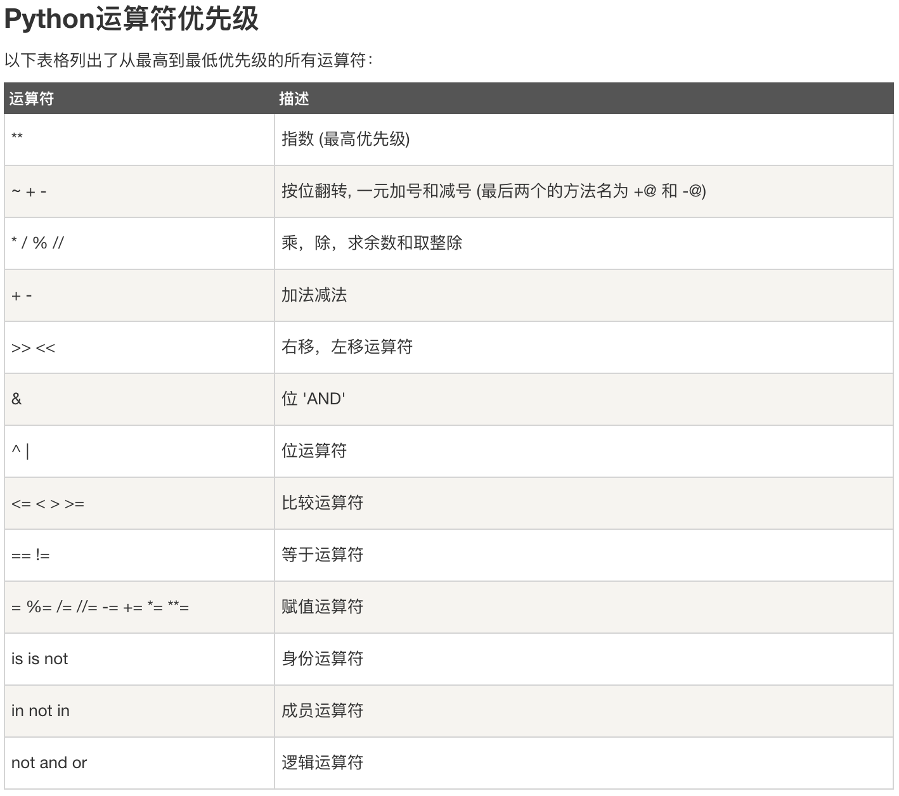

# 从Runoob上学习Python（完结）

  + [标准数据类型](#标准数据类型)

  + [运算符](#运算符)

## 标准数据类型

  + 不可变：number(int, float, bool, complex), string(str), tuple(tuple)
  
  + 可变：list(list), dictionary(dict), set(set, frozenset)
  
  + type(obj) # 函数可以查询对象类型
  
  + instance(obj1, obj2) # 函数可以比较两个对象类型是否相同
  
    - type()不会认为子类是一种父类类型
   
    - isinstance()会认为子类是一种父类类型
   
  + 数据转换内置函数
  
    - repr(obj) # 将对象 x 转换为表达式字符串
   
    - eval(str) # 用来计算在字符串中的有效Python表达式,并返回一个对象
   
    - chr(int) # 将一个整数转换为一个字符
   
    - ord(str) # 将一个字符转换为它的整数值
   
    - hex(int) # 将一个整数转换为一个十六进制字符串
   
    - oct(int) # 将一个整数转换为一个八进制字符串

## 运算符

  + 算术运算符：+, -, *, /, %, **, //
  
  + 比较（关系）运算符：==, !=, >, <, >=, <=
  
  + 赋值运算符：=, +=, -=, *=, /=, %=, **=, //=, :=('>=python3.8')
  
  + 逻辑运算符：and, or, not
  
  + 位运算符：&, |, ^, ~, <<, >>
  
  + 成员运算符：in, not in
  
  + 身份运算符：is, not is # a is b <==> id(a) == id(b)
  
  + 运算符优先级
  
    - 
