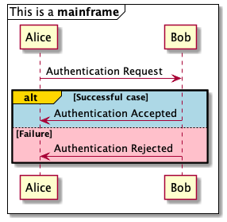
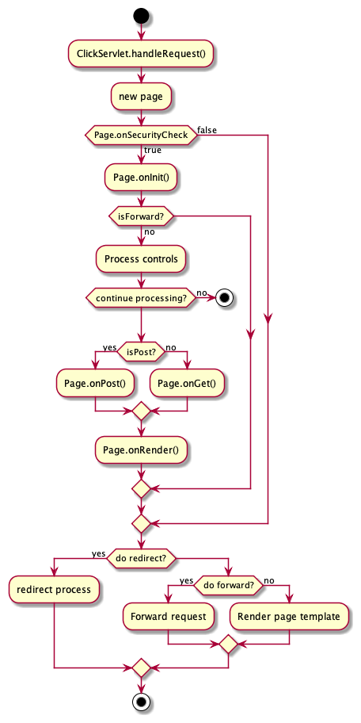
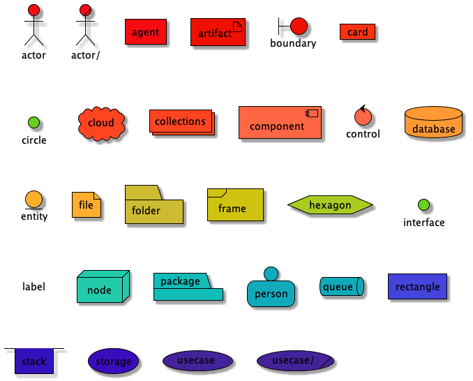
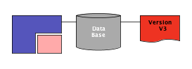

# 从PlantUML上学习UML

  + [运行](#运行)

  + [UML](#UML)

    - [时序图](#时序图)

    - [用例图](#用例图)

    - [类图](#类图)
  
    - [对象图](#对象图)

    - [活动图](#活动图)

    - [组件图](#组件图)

    - [部署图](#部署图)

    - [状态图](#状态图)

    - [定时图](#定时图)
  
  + [非UML](#非UML)

    - [JSON数据](#json数据)

    - [YAML数据](#yaml数据)

    - [网络图](#网络图)

    - [线框图形界面](#线框图形界面)

    - [架构图](#架构图)
  
    - [规范和描述语言](#规范和描述语言)

    - [Ditaa图](#ditaa图)

    - [甘特图](#甘特图)

    - [思维导图](#思维导图)

    - [WBS工作分解图](#wbs工作分解图)

    - [LaTexMath](#以asciimath或jlatexmath符号的数学公式)
  
    - [实体关系图](#实体关系图)

## 运行

***

  + create sequenceDiagram.txt

  + java -jar plantuml.jar sequenceDiagram.txt

  + import sequenceDiagram.png to markdown file

## UML

***

### 时序图

***

  + 

  + 

  + 

### 用例图

***

  + 

### 类图

***

  + 
  
  + 
  + 
  + 
  + 

  + 

### 对象图

***

  + 

### 活动图

***

  + 

  + 

### 组件图

***

  + 

### 部署图

***

  + 

  + 

### 状态图

***

  + 

### 定时图

***

  + 

## 非UML

***

### JSON数据

***

  + 

### YAML数据

***

  + 

### 网络图

***

  + 

### 线框图形界面

***

  + 

  + 

### 架构图

***

  + 

  + 

### 规范和描述语言

***

  + 

### Ditaa图

***

  + 

### 甘特图

***

  + 

### 思维导图

***

  + 

### WBS工作分解图

***

  + 

### 以AsciiMath或JLaTeXMath符号的数学公式

***

  + 

### 实体关系图

***

  + 
