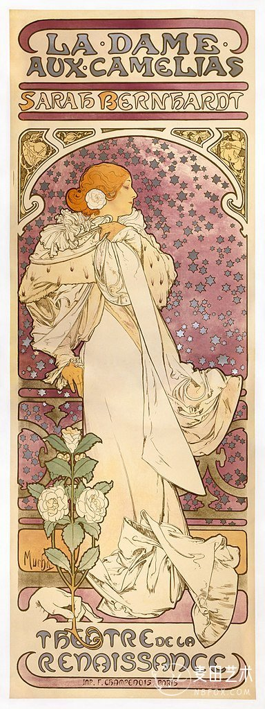
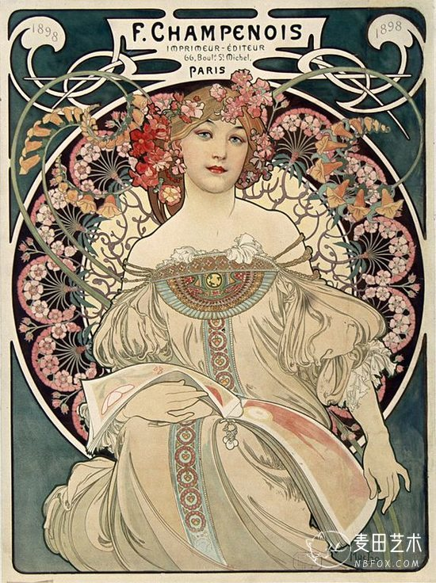
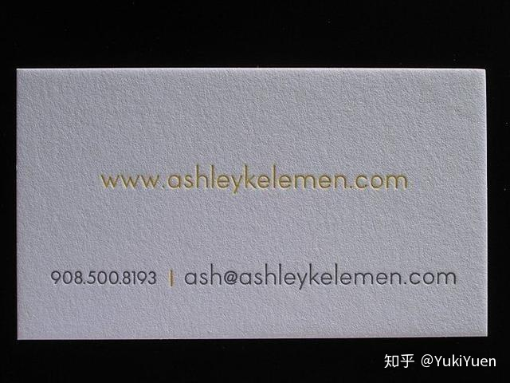
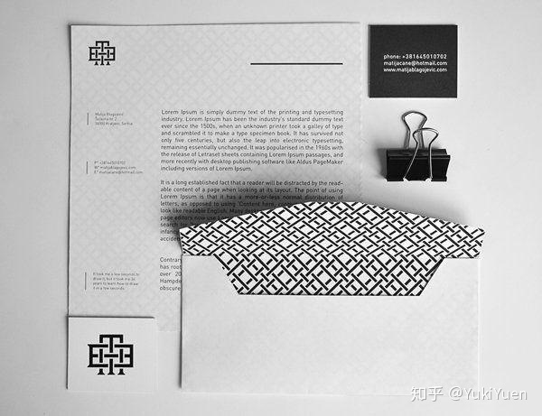
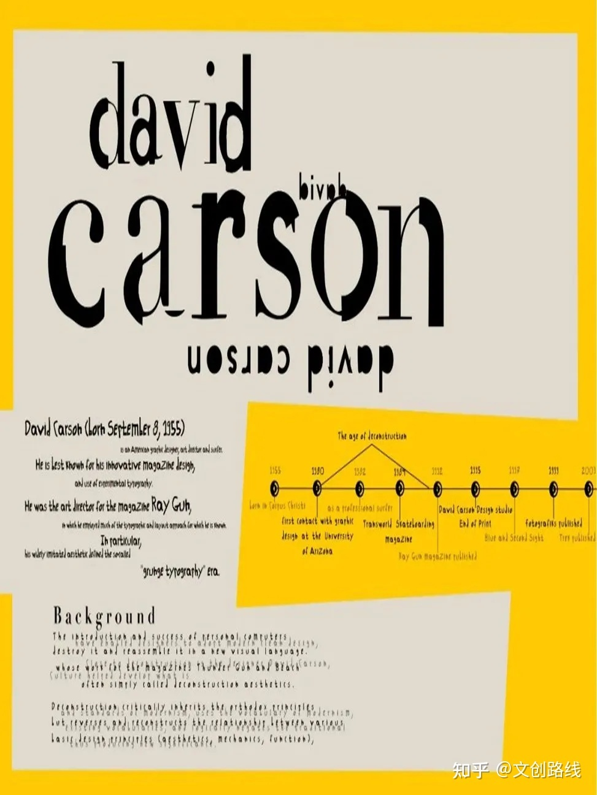
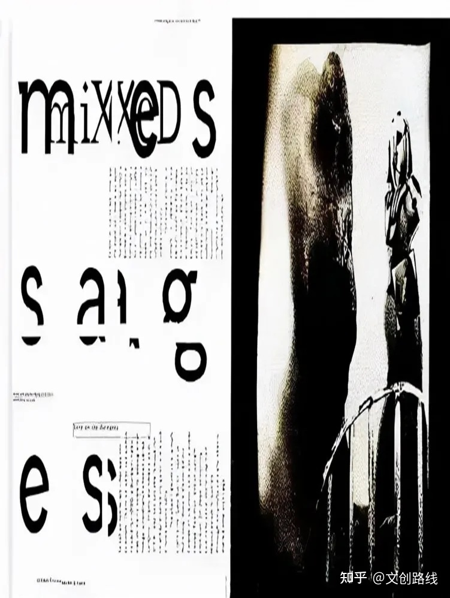
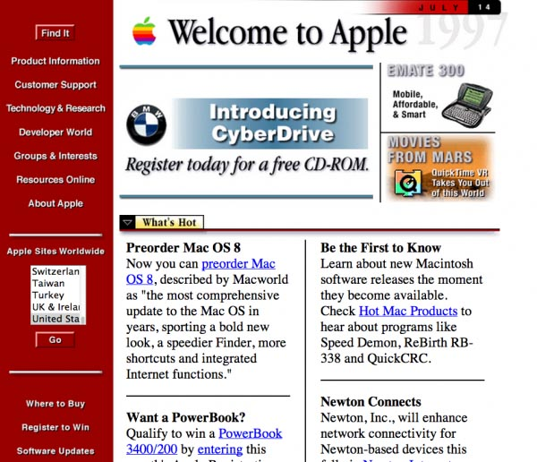
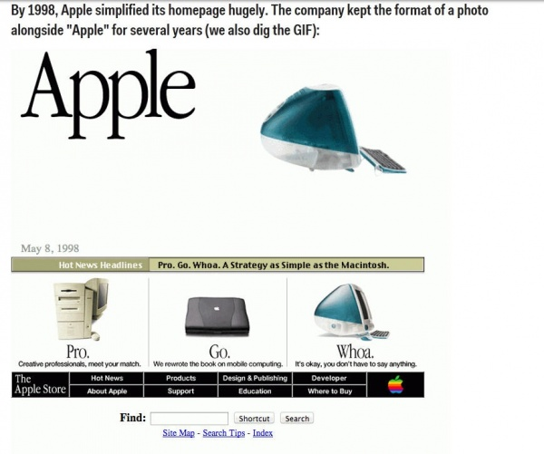
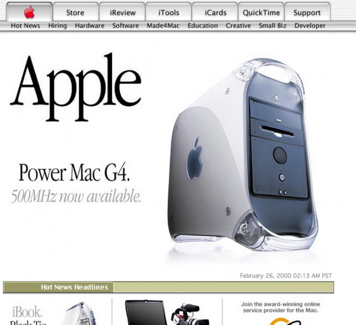
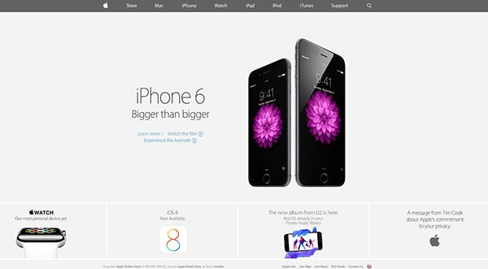

# 从Youtuber-Flux学习Web Design

## 网页设计简介

  + 平面设计基础：排版，颜色，布局等。

  + 网络技能：UX/UI，流程图，交互，开发。

  + 软件：使用和掌握PS，AI，XD。

## 基本网页设计软件

  + 图像编辑软件：Adobe Photoshop

  + 矢量编辑软件：Adobe Illustrator

  + 屏幕设计软件：Adobe XD

  + 动画软件（不探讨）

## 网页设计简史

  + 新艺术运动（Art Nouveau），是19世纪末20世纪初在欧洲和美国产生并发展的一次影响面相当大的“装饰艺术”的运动。延续长达十余年，是设计史上一次非常重要的形式主义运动。

    - 非常复杂，使用装饰来让图画变得漂亮。

    - 

    - 

  + 瑞士设计（Swiss Design），起源于瑞士的装饰风格，瑞士风格将家装中比较繁杂的形式简化，增大舒适性比例，实用性极强的瑞士风格设计俨然成为了家居时尚的风向标。

    - 

    - 

  + 戴维卡森，开创了“grunge”时代。

    - 

    - 

  + 网页设计（技术推动）

    - 基本的文本和图片设计

    - 不同类型的背景颜色和字体设计

      - 

    - 使用平面设计的技巧去排版

      - 

    - 从拟物化到扁平化

      - 

      - 

    - 从自适应布局到响应式布局

    - 3D粒子动画（WebGL）

## 排版入门

  + 字体的作用：传递信息，传达价值观。

  + 衬线字体（serif）和无衬线字体（sans-serif）

  + 排版：整体层次，颜色，对齐等。

  + 词汇的排版：字号，字间距，行距，是否多行等。

  + 语句的排版：字号，行间距，Orphans and Widows等。

  + 字体推荐：Garamond，Bodoni，Century Expanded，Futura，Times Roman，Helvetica。

  + [type-scale](https://type-scale.com/)
