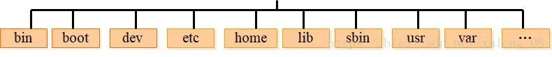
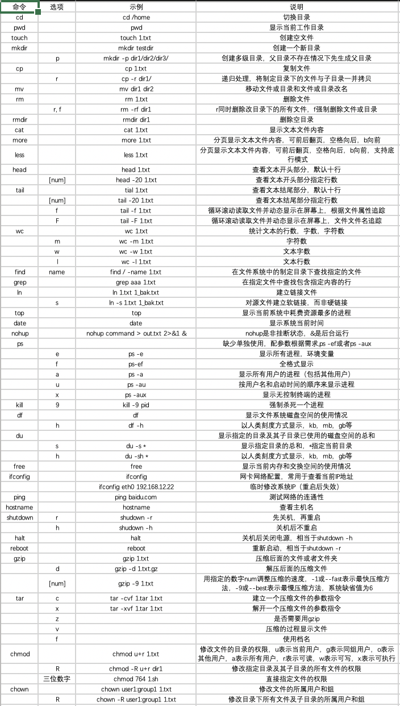
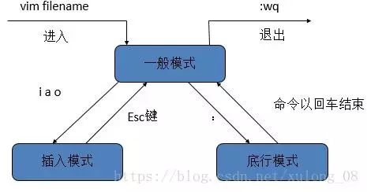

# Linux快速入门
linux是目前应用最广泛的服务器操作系统，基于Unix，开源免费，由于系统的稳定性和安全性，市场占有率很高，几乎成为程序代码运行的最佳系统环境。

  + [Linux的目录结构](#linux的目录结构)

  + [Linux常用命令](#linux常用命令)

  + [Linux系统常用快捷键及符号命令](#linux系统常用快捷键及符号命令)

  + [VIM编辑器](#vim编辑器)
 
## Linux的目录结构
 
  + 

  + bin(binaries) 存放二进制可执行文件
  
    - like: cat, mkdir, kill, rm
  
  + dev(devices) 用于存放设备文件
 
    - like: stdin, stdout, stdout
  
  + etc(etcetera) 存放系统配置文件
 
    - like: hosts, shells
  
  + home 存放用户文件的根目录
 
    - test用户的目录为/home/test
  
  + lib(library) 存放跟文件系统中的程序运行所需要的共享库及内核模块
 
    - like: gcc, python3.6, systemd
  
  + sbin(super user binaries) 存放二进制可执行文件，只有root才能访问
 
    - reboot, shutdown, ping, mount, umount
  
  + tmp(temporary) 公共的临时文件存储点
 
  + root 超级用户的根目录
 
  + mnt(mount) 系统管理员安装临时文件系统的安装点
 
  + lost+found 系统异常关机留下的“无家可归”文件
 
  + proc 系统内存映射的虚拟目录
 
  + var(variable) 用于存放运行时需要改变数据的文件
 
  + usr(unix shared resources) 用于存放共享的系统资源
 
## Linux常用命令

  + 命令格式：命令 -选项 参数
 
  + 

  + 查看操作系统

    - cat /etc/issue
 
## Linux系统常用快捷键及符号命令

  + ctrl \+ c 停止进程
 
  + ctrl \+ l 清屏
 
  + ctrl \+ r 搜索历史命令
 
  + ctrl \+ q 退出
 
  + tab 自动补全
 
  + * 通配符
 
  + | 管道命令，以前一个命令的输出作为输入，然后进行计算
 
  + > >> 重定向 like：echo "haha" > 1.txt
 
## Vim编辑器

  + 
 
  + i 在光标前插入
 
  + I 在光标当前行开始插入
 
  + a 在光标后插入
 
  + A 在光标当前行末尾插入
 
  + o 在光标当前行的下一行插入新行
 
  + O 在光标当前行的上一行插入新行
 
  + gg 跳到首行
 
  + G 跳到末行
 
  + :n 跳到第n行
 
  + :wq 保存并退出
 
  + :set nu 显示行号
 
  + :set nonu 取消行号
 
  + x 删除光标所在处字符
 
  + nx 删除光标所在处后的n个字符
 
  + dd 删除光标所在行。ndd删除n行
 
  + dG 删除光标所在行到末尾行的所有内容
 
  + D 删除光标所在处到行尾的内容
 
  + v V ctrl \+ v 进入可视模式
  
  + split 上下显示两个窗口
  
  + vsplit 左右显示两个窗口
