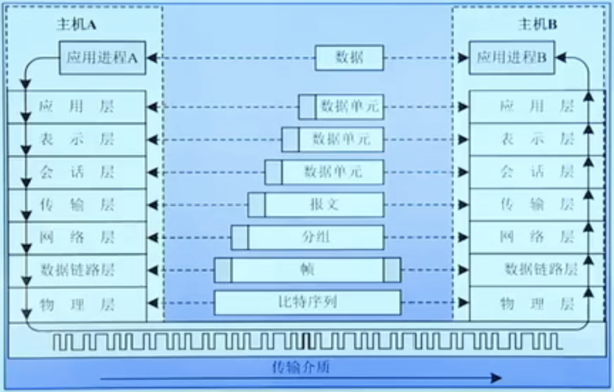
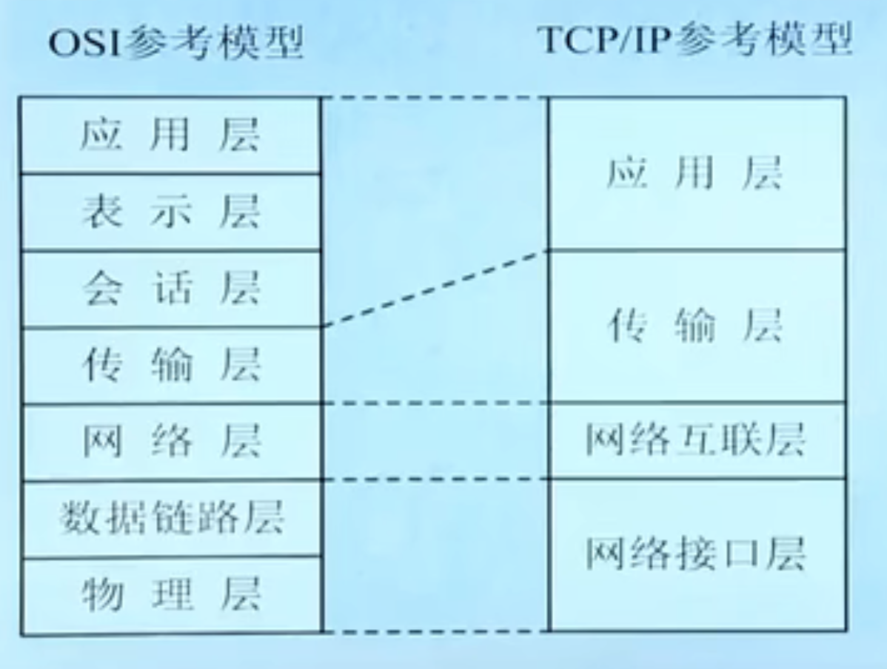

# 网络协议和体系结构

## 网络协议和体系结构概述

  + 网络协议：通信双方必须遵守的规则和约定称为协议或规程。协议的要素包括语法、语义和时序。

  + 分层

    - 分层的核心思想是上一层的功能建立在下一层的功能基础上，并且在每一层内均要遵循一定的通信规则。

    - 分层的好处：各层次之间可相互独立；有较强的灵活性；分层的思想有利于标准化。

  + 网络体系结构

    - 层次和协议的集合构成了网络的体系结构。

    - 体系结构研究的是网络系统各部分的组成及其相互关系。

    - 目前，典型的层次化体系结构有OSI参考模型和TCP/IP参考模型两种。

## OSI参考模型

  + 1984年，负责制定国际标准的国际标准化组织ISO吸取了IBM的SNA和其他计算机厂商的网络体系结构，提出了开放系统互连参考模型（OSI/RM）。“开放”是指按照这个标准设计和建成的数据通信网中的设备都可以相互通信。

  + OSI参考模型采用分层结构化技术，将整个网络的通信功能分为7层，由低到高分别是：物理层、数据链路层、网络层、传输层、会话层、表示层和应用层。

    - 

    - 资源子网中的计算机含有全部7层，其中网卡实现物理层和数据链路层，操作系统实现网络层、传输层、会话层和表示层，应用软件实现应用层。通信子网中的路由器实现3层，分别是物理层、数据链路层和网络层。

    - 物理层：实现比特流传输，实现信号编码功能；规定数据终端设备（计算机）DTE与数据通信设备（调制解调器）DCE的接口特性。包括机械、电气、功能和规程四个方面。

    - 数据链路层：传输以“帧”为单位的数据块，进行差错控制、连接管理等功能。

    - 网络层：数据转发和路由、流量控制、寻址（IP地址）。

    - 传输层：端到端通信（进程-进程）。

    - 会话层：用户和用户的连接、通过在两台计算机间建立、管理和终止通信完成对话。实际应用中被应用层覆盖。

    - 表示层：主要处理应用实体间交换数据的语法，解决格式和数据表示的差异，为应用层提供统一的数据格式。还可以实现压缩（解压缩），加密（解密），字符编码的转换功能。实际中，该层功能由应用层实现，不单独存在。

    - 应用层：提供给用户相关的网络服务接口。

  + OSI参考模型的有关术语

    - 数据单元：在层的实体之间传送的比特组称为数据单元。

    - 协议数据单元PDU：在对等层之间传送数据单元是按照本层协议进行的，这时的数据单元称为协议数据单元。

    - PDU在不同层往往有不同的叫法：物理层中称为位流或比特流，数据链路层中称为帧，网络层中称为分组或包，传输层中称为数据段或报文段，应用层中称为报文。

    - 服务访问点：相邻层间的服务是通过其接口面上的服务访问点SAP进行的，N层SAP就是N+1层可以访问N层的地方。每个SAP都有唯一的一个地址。

    - 服务原语：OSI参考模型有四种原语。

      - 请求（Request）：上层向本层请求指定的服务。

      - 确认（Confirm）：本层响应上层的请求。

      - 指示（Indication）：本层发送给上层用来指示本层的某一个事件。

      - 响应（Response）：上层响应本层的指示。

    - 面向连接和无连接

      - 面向连接：需要请求建立连接、连接建立、传输数据和拆除链路的过程。如果接收方收到数据后予以确认，就是可靠传输；不确认，就是不可靠传输方式。

      - 无连接：没有链路建立和拆除的过程，也称为数据报服务。每个分组单独选择路径，无序、接收方需要重组分组。

## TCP/IP参考模型

  + TCP/IP参考模型将整个网络的通信功能分为4层，由低到高分别是：网络接口层、网络互联层、传输层和应用层。

    - 

    - TCP/IP参考模型中，无论网络接口层采用什么类型的协议，只需要网络互联层采用IP协议，即可将异构的网络互联起来。

    - 应用层

      - Internet上常见的应用大多在这一层，用户通过应用层来使用Internet提供的相应服务。

      - TCP/IP应用层基本的协议主要有：

        - 远程登录协议（TELNET）。

        - 文件传输协议（FTP）。

        - 简单邮件传输协议（SMTP），POP3协议。

        - 超文本传输协议（HTTP）。

        - 域名服务（DNS）协议。

        - 简单网络管理协议（SNMP）。

        - 动态主机配置协议（DHCP）。

    - 传输层：负责在会话进程之间建立和维护端-端（进程-进程）连接，实现网络环境中分布式进程通信。传输层主要包括面向连接、提供可靠数据流传输的传输控制协议（TCP）和无连接、不提供可靠数据传输的用户数据报协议（UDP）。TCP协议提供比较完善的流量控制和拥塞控制。

    - 网络互联层

      - 该层协议主要是IP协议，一种不可靠、无连接的数据报传送服务协议。本层的协议数据单元是IP分组。该层设备是路由器，负责路由转发和IP分组寻址。

      - 网络互联层还包括互联网控制报文协议（ICMP）、互联网多播组管理协议（IGMP），地址转换协议（ARP），反向地址转换协议（RARP）以及路由协议，如BGP，OSPF和RIP等。

    - 网络接口层：本层的具体实现方法随着网络类型不同而不同，允许使用广域网、局域网与城域网的各种协议。只要遵循网络互联层的IP协议即可。

    - 在实际的数据通信过程中，用户的数据在应用层以报文的形式开始向下一层进行封装，形成报文、报文段、帧，最后以比特流的形式在不同的传输介质上进行传输。

  + TCP/IP参考模型和OSI参考模型的相似之处：都是按照层的思想对计算机网络进行模块化设计，形成了一组自上而下的单向依赖关系的协议栈。

  + TCP/IP参考模型和OSI参考模型的区别：层次划分不同；面向连接和面向无连接的通信不同；与具体协议的配合程度。

