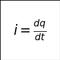

# 电路分析基础

## 电路的基本概念

  + 电路和电路模型

    - 电路：为了某种需要由若干电工设备或元件按一定方式组成的总体，是电流的通路。

    - 电路一般由电源、负载及中间环节三部分组成。

    - 电路的作用：实现电能的输送和变换；实现信号的传递和处理。

    - 电路模型：我们需将实际元件理想化（或称为模型化），即在一定条件下突出其主要的电磁性质，忽略其次要的因素，把它近似地看作理想电路元件。因此，理想电路元件也就是具有某种确定的电磁性质的假想元件，它是一种理想化的模型并具有精确的数学定义。

    - 理想电路元件包括理想无源元件和理想有源元件。前者包括理想电阻、理想电感和理想电容元件；后者包括理想独立电源和理想受控电源元件。这些元件分别由相应的符号和参数来表证。

  + 直流电与交流电

    - 直流电：把方向不随时间变化的电压（或电流）都称为直流电压（或电流）。如果电压（或电流）的大小和方向都不随时间变化，则称为恒定直流电压（或电流）。仅是大小变化而方向不改变的电压（或电流），则称为脉动直流电压（或电流）。

    - 交流电：指大小和方向都随时间变化的电压或电流。随时间按正弦规律变化的电压和电流称为正弦交流电。通常所说的交流电也就指的是正弦交流电。

  + 模拟信号与数字信号

    - 现代电子技术是由模拟电子技术和数字电子技术两大部分组成的。

    - 模拟信号：随时间连续变化的电压或电流信号，如正弦信号就是一种最为典型的模拟信号。

    - 模拟电路：处理模拟信号的电子线路。

    - 数字信号：随时间断续变化的电压或电流信号，如方波信号就是一种最为典型的数字信号。

    - 数字电路：处理数字信号的电子线路。

  + 电路的基本物理量及其参考方向

    - 电流及其参考方向

      - 

      - 在国际单位制中，Q为电荷量，其单位为库仑（C）；t为时间，单位为秒（s）；I是电流，其单位为安培，简称安（A）。

      - 电流的参考方向：任意假定。

      - 所选的电流参考方向并不一定与实际方向相同。如果相同，这时电流的值为正，否则为负；只有当参考方向选定以后，电流才可称为一个代数量，这时讨论电流的正负才有意义，而后根据电流的正负就可以确定电流的实际方向。

    - 电压、电动势及其参考方向

      - 

      - 电压表明了电场力对电荷做功的能力。

      - 

      - 规定电场力对单位正电荷从电场内的a点移动到无限远处所做的功称为a点的电位Va，因为在无限远处的电场为零，故其电位也为零。可见，a、b两点间的电压也就是a、b两点间的电位差。

      - 电动势E用来衡量电源力（非电场力）对电荷做功的能力，在电源力的作用下，电源不断地把其他形式的能量转换为电能以维持电路的持续工作。

      - 电压的实际方向：由高电位端指向低电位端。电动势的实际方向：由低电位端指向高电位端。

      - 电压的参考方向：任意假定。

    - 关联参考方向

  + 电路中产生电压的过程

    - 从源头来说是电池在整个电路中形成了电场，电场形成电压。电池就是形成电势差的地方。

    - 当电池与外部电路连接后，整个微观上：电池内部的非电场力（化学反应做功）使得电池正负极两端分别积聚正电荷和负电荷，从而在整个电路（包括电池内部）瞬间形成电场，电荷在整个电场的作用下进行定向移动，形成电流。

    - 电池电势差的形成包括两方面的作用：非电场力作用促进电势差的形成和电荷积聚效应产生的电场阻碍电势差形成。因为非电场力作用大于电荷积聚的副作用，所以形成电势差。

    - 电子在电场力的作用下在闭合电路中定向移动，移动到用电设备的时候，用电设备的电阻作用使得这些电子不易通过该设备，在设备的两端又用了电荷积聚，这时设备两端就有了电压差。

    - 电流从插头的一极流入，流经用电器，转化成机械能、内能或其他形式的能量，再从插头的另一极留出。这过程中用电器实际消耗的是电势能。自由电荷在电势的作用下，从高电势流向低电势处形成电流，电流流经用电器，消耗部分电势能，带动用电器工作。

## 电阻、电感和电容

## 电源元件

## 串联电路与并联电路

## 直流电路分析与计算

## 正弦交流电路
