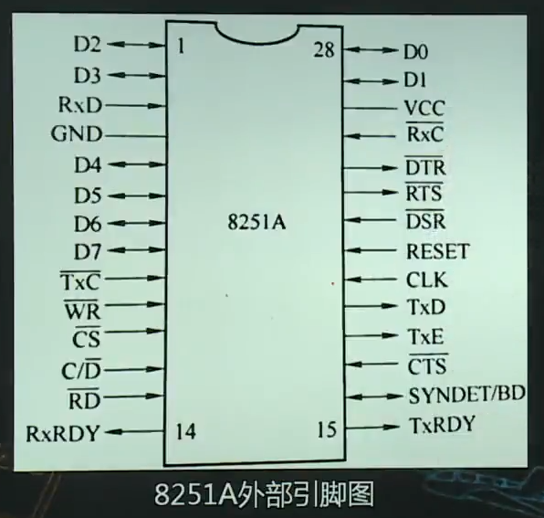
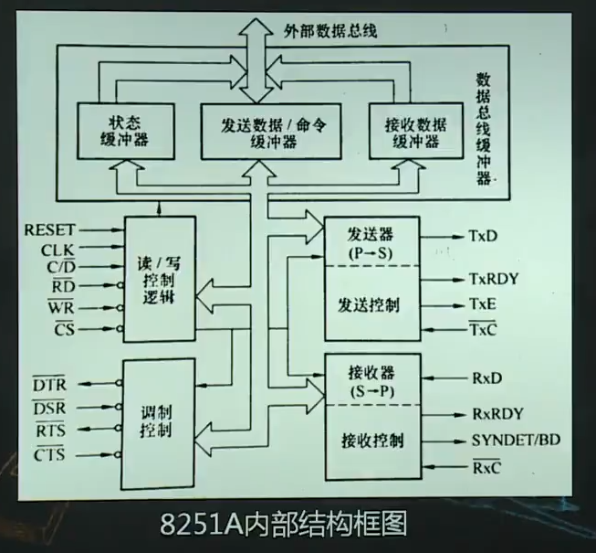

# 串行通行和串行接口

  + [串行通信的基本概念](#串行通信的基本概念)

  + [串行通信协议](#串行通信协议)

  + [串行接口标准接口RS-232C](#串行接口标准接口rs-232c)

  + [可编程串行接口芯片8251A](#可编程串行接口芯片8251a)

## 串行通信的基本概念

***

  + 串行通信：将数据的各个位一位一位地，通过单条一位宽地传输线按顺序分时传送，即通信双方一次传输一个二进制位。

  + 数据传输方式：单工，半双工，全双工

    - 

  + 波特率和收/发时钟

    - 波特率：衡量数据传输速率，bit/s。

    - 收/发时钟：串行通行中，发送和接收都必须有时钟脉冲信号对传送的数据进行定位和同步控制。

    - 收/发时钟频率=n x 波特率。异步通信，n=16；同步通信，n=1。

  + 信号调制解调

    - 调制：发送方需要使用调制器，把要传送的数字信号调制为适合在线路上传输的模拟信号。

    - 解调：接收方使用解调器从线路上测出这个模拟信号，并还原成数字信号。

    - 调制解调器：兼具调制和解调的功能。

  + 串行通信基本方式

    - 异步串行通信：以字符为信息单位，发送端发出的每个字符在数据流中出现的时间是任意的，没有严格的定时要求。

    - 同步串行通信：以数据块为信息单位，每帧信息包括成百上千个字符。收/发端必须使用同一时钟控制数据库中字符与字符和字符内部位与位之间的定时。对时钟同步要严格。

## 串行通信协议

***

  + 通信协议：通信双方对数据传送控制的一种约定，又称通信规程。

  + 异步串行通信协议：依靠起始位和停止位来进行字符同步。

  + 同步串行通信协议：以数据块位单位传送，每个数据块由一个字符序列组成，每个字符取相同位数，字符间连续，没有起始位和停止位，不能由空隙。

## 串行接口标准接口RS-232C

***

  + 采用负逻辑，逻辑1=-3~-15V，逻辑0=3~15V。

## 可编程串行接口芯片8251A

***

  + 

  + 
