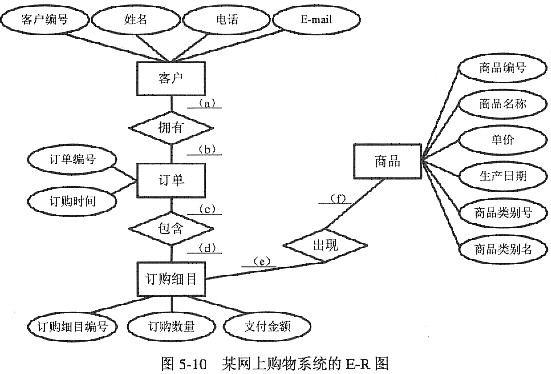

# 数据库系统基本概念

## 数据库系统概述及概念模型

  + 数据（Data）是数据库中存储的基本对象。数据的含义称为数据的语义。

  + 数据库（Database）是长期存储在计算机内、有组织的、可共享的大量数据集合。

    - 数据库特征：

      - 数据按一定的数据模型组织、描述和储存。

      - 可为各种用户共享。

      - 冗余度较小。

      - 数据独立性较高。

      - 易扩展。

  + 数据库管理系统（DBMS）是位于用户与操作系统之间的一层数据管理软件。

    - DBMS的用途：

      - 科学地组织和存储数据、高效地获取和维护数据。

      - 数据库定义功能。

      - 数据组织、存储和管理。

      - 数据操纵功能：提供数据操纵语言。

    - DBMS的主要功能：

      - 数据定义功能

      - 数据操纵功能

      - 数据库的运行管理。

      - 数据库的建立和维护。

  + 数据库系统（DBS）是指在计算机系统中引入数据库后的系统构成。

  + 数据库系统的构成：由数据库、数据库管理系统（及其开发工具）、应用系统、数据库管理员（和用户）构成。

  + 数据库的特点：

    - 数据的管理者：DBMS

    - 数据面向的对象：现实世界

    - 数据的共享程度：共享性高

    - 数据的独立性：高度的物理独立性和一定的逻辑独立性

    - 数据的结构化：整体结构化

    - 数据控制能力：由DBMS统一管理和控制

  + 数据独立性分为逻辑数据独立性和物理数据独立性

  + 数据管理技术经历了人工管理、文件管理、数据库系统三个阶段。

## 概念模型及逻辑模型

  + 数据模型

    - 概念模型，也称信息模型。它是按用户的观点来对数据和信息建模，主要用于数据库设计。

    - 逻辑模型，主要包含网状模型，层次模型，关系模型等，它是按照计算机系统的观点对数据建模。

    - 物理模型，是对数据最底层的抽象，描述数据在系统内部的表示方式和存取方法，在磁盘或磁带上的存储方法和存取方法，是面向计算机系统的。

    - 数据模型是数据库系统的核心和基础。

  + 数据模型的组成要素：

    - 数据结构：描述数据库的组成对象及对象之间的联系。

    - 数据操作：是指数据库中各种对象的实例允许执行的操作的集合，包括操作及其有关操作规则。

    - 数据的约束条件：一组完整性规则的集合。完整性规则是给定的数据模型中数据及其联系所具有的制约和存储规则。

  + 概念模型

    - 信息世界中的基本概念

      - 实体（Entity），属性（Attribute），码（Key），域（Domain），实体型（Entity Type），实体集（Entity Set），联系（Relationship）

    - 概念模型的表示方法：实体-联系方法（E-R方法）

      - 用E-R图来描述现实世界的概念模型，它提供了表示实体型、属性和联系的方法。

      - 

  + 逻辑模型

    - 层次模型（树）

      - 满足下面连个条件的基本层次联系的集合为层次模型

        - 有且只有一个结点没有双亲结点，这个结点称为根结点。

        - 根以外的其他结点有且只有一个双亲结点。

      - 表示方法

        - 实体型：用记录类型描述。每个结点表示一个记录类型

        - 属性：用字段描述。每个记录类型可包含若干个字段。

        - 联系：用结点之间的连线表示记录型之间的一对多的联系。

    - 网状模型（图）

      - 满足下面两个条件的基本层次联系的集合为网状模型：

        - 允许一个以上的结点无双亲。

        - 一个结点可以有多于一个的双亲。

      - 表示方法（与层次数据模型相同）

    - 关系模型

      - 关系模型中的数据的逻辑结构是一张二维表。它由行和列组成。
