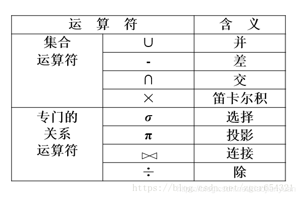

# 关系数据库

  + [关系数据库概述](#关系数据库概述)

  + [关系数据模型](#关系数据模型)

  + [关系数据库的规范化理论](#关系数据库的规范化理论)

## 关系数据库概述

***

  + E.F.Codd于1970年提出关系数据模型。

  + 80年代后，关系数据库系统称为最重要，最流行的数据库系统。

## 关系数据模型

***

  + 关系数据结构：关系模型的数据结构非常简单，只包含单一的数据结构，即关系（二维表）。

  + 基本术语

    - 表（Table）：也称为关系，是一个二维的数据结构，它由表名、构成表的各个列及若干行数据组成。

    - 关系（Relation）：一个关系逻辑上对应一张二维表，可以为每个关系取一个名称进行标识。

    - 列（Column）：也称为字段（Field）或属性（Attribute）。表中每一列有一个名称，称为列名、字段名或属性名。每一列表示实体的一个属性，具有相同的数据类型。

    - 行（Row）：也称为元组（Tuple）或记录（Record）。

    - 超码或超键（Super Key）：如果在关系中的一个码中移去某个属性，它仍然是这个关系的码，则称这样的码或键为该关系的超码或超键。

    - 候选码或候选键（Candidate Key）：如果在关系的一个码或键中，不能从中移去任何一个属性，否则它就不是这个关系个码或键，则称这样的码或键为改关系的候选码或候选键。

    - 主码或主键（Primary Key）：在一个关系的若干个候选码或候选键中指定一个用来唯一标识关系的元组，则称这个被指定的候选码或候选键为该关系的主码或主键。

    - 全码或全键（All-Key）：一个关系的所有属性集合是这个关系的主码或主键，则称这样的主码或主键为全码或全键。

    - 外码或外键（Foreign Key）：当关系中的某个属性（或属性组）不是这个关系的主码或候选码，而是另一个关系的主码时，称该属性为这个关系的外码或外键。

    - 主属性和非主属性：在一个关系中，如果一个属性是构成某一个候选关键字的属性集中的一个属性，则称它为主属性。不包含在任何一个候选码中的属性称为非主属性。

    - 参照关系（Referencing Relation）和被参照关系（Referenced Relation）：以外码作为主码的关系称为被参照关系，外码所在的关系称为参照关系。

    - 关系数据库（Relation Database）：关系数据库是以关系模型作为数据的逻辑模型，并采用关系作为数据组织方式的一类数据库，其数据库操作建立在关系代数的基础上。

  + 基本关系操作

    - 查询：选择（Selection），投影（Projection），连接（Join），除（Division），并（Union），交（Intersection），差（Set difference），笛卡尔积（Cartesian Product）

    - 更新：插入，删除，修改

    - 查询的表达能力很强，是其中最主要的部分。关系操作的特点是集合操作方式，即操作的对象和结果都是集合。

    - 

  + 关系的完整性约束

    - 实体完整性约束（Entity Integrity Constraint）：实体完整性约束是指关系的主属性，即主码的组成不能为空，也就是关系的主属性不能为空值NULL。

    - 参照完整性约束（Referential Integrity Constraint）：关系中不允许引用不存在的实体。

    - 用户定义完整性约束（User-defined Integrity Constraint）：用户定义的完整性约束是针对某一应用环境的完整性约束条件，它反映了某一具体应用所涉及的数据应满足的要求。

## 关系数据库的规范化理论

***

  + 函数依赖：设R为任一给定关系，如果对于R中属性X的每一个值，R中的属性Y只有唯一值与之对应，则称X函数决定Y或称Y函数依赖于X，记作X->Y。

    - 完全函数依赖：设R为任一给定关系，X、Y为其属性集，若X->Y，且对于X中的任何真子集X'都有X'-/->Y，则称Y完全依赖于X。

    - 部分函数依赖：设R为任一给定关系，X、Y为其属性集，若X->Y，且X中存在一个真子集X'满足X'->Y，则称Y部分函数依赖于X。

    - 传递函数依赖：设R为任一给定关系，X、Y、Z为其不同属性子集，若X->Y，Y-/->X，Y->Z，则有X->Z，称为Z传递函数依赖于X。

  + 范式与关系规范化过程

    - 第一范式（1NF）：每一列都不可分割。

    - 第二范式（2NF）：消除非主属性对码的部分函数依赖。

    - 第三范式（3NF）：消除非主属性对码的传递函数依赖。

    - BC范式（BCNF）：消除主属性对码的部分和传递函数依赖。
