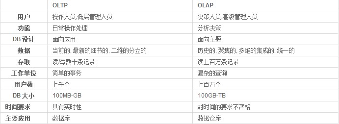

# 数据管理技术的发展

  + [数据库技术发展概述](#数据库技术发展概述)

  + [数据仓库与数据挖掘](#数据仓库与数据挖掘)

  + [大数据管理技术](#大数据管理技术)

## 数据库技术发展概述

***

  + 第一代数据库系统

    - IMS 层次模型 IBM 1969

    - CODASYL 网状模型 DBTG 1970

    - 特点：支持三级模式，用存取路径表示联系，独立的DDL，导航的DML

  + 第二代数据库系统

    - IBM-System-R 关系模型

  + 第三代数据库系统：面向对象数据库（OODB）

    - 特点：应支持数据管理、对象管理和知识管理。保持和继承RDB的技术。开放性。

  + 新一代数据库系统；对象关系数据库（ORDB）

## 数据仓库与数据挖掘

***

  + 事务型处理数据（OLTP）和分析型处理数据（OLAP）的区别（数据库和数据仓库的区别）

    - 

  + 数据仓库（Data Warehouse）的主要特征：面向主题，集成性，数据的非易失性，数据的时变性。

  + 数据仓库的三个重要概念：

    - 粒度：指数据仓库的数据单位中保存数据的细化或综合程度的级别。

    - 分割：将数据分散到各自的物理单元中，以便能分别处理，以提高数据处理的效率。

    - 维：人们观察数据的特定角度，是考虑问题时的一类属性。

  + 数据挖掘（Data Mining）是从大量的、不完全的、有噪声的、模糊的、随机的实际应用数据中发现并提取隐藏在其中的、人们事先不知道的、但又是潜在有用的信息和知识的一种技术。

## 大数据管理技术

***

  + 大数据：尚无统一的定义，通常被认为是数据量很大、数据形式多样化的数据。

  + 大数据的特征：大量化，多样化，快速化，价值密度低。

  + 大数据存储：

    - Hadoop（分布式解决方案）：最核心的设计是HDFS和MapReduce，HDFS为海量的数据提供了存储，而MapReduce则为海量的数据提供了计算。

    - NoSQL数据管理系统：键值存储，Redis；文档存储，MongoDB；列存储，Hbase；图存储。
